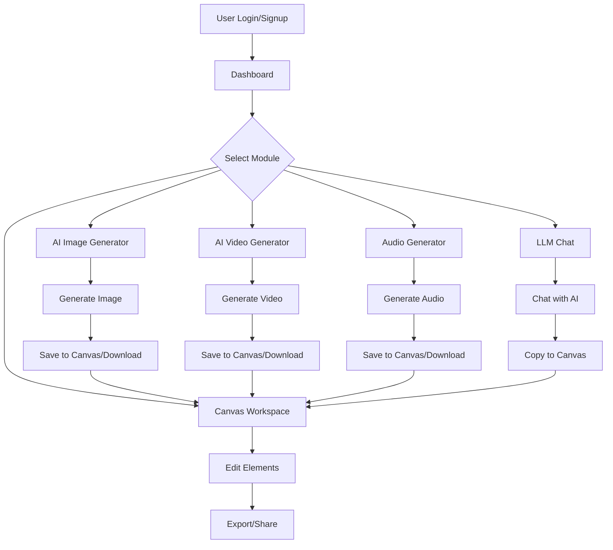

## 1. Product Overview
A comprehensive AI aggregation platform designed for video creators, designers, and AI image enthusiasts. It integrates five core AI-powered modules: image generation, video generation, audio generation, LLM chat, and infinite canvas, providing a one-stop creative workspace.

- **Target Users**: Video creators, graphic designers, AI art enthusiasts, content producers
- **Market Value**: Streamlines the creative workflow by consolidating multiple AI tools into a single platform, eliminating the need to switch between different applications

## 2. Core Features

### 2.1 User Roles
| Role | Registration Method | Core Permissions |
|------|---------------------|------------------|
| Normal User | Email/Google registration | Access all AI generation modules, create and save projects, use canvas workspace |
| Premium User | Subscription payment | Higher resolution outputs, priority processing, advanced features |

### 2.2 Feature Modules
1. **AI生图模块**: Text-to-image, image style transfer, image restoration/enhancement
2. **AI生视频模块**: Text-to-video, image-to-video, video stylization
3. **音频生成模块**: Text-to-speech, background music generation, sound effects
4. **大语言模型对话模块**: Multi-turn conversation, creative content generation, knowledge Q&A
5. **无线画布功能**: Infinite canvas workspace with drag-and-drop editing, layer management

### 2.3 Page Details

| Page Name | Module Name | Feature Description |
|-----------|-------------|---------------------|
| Dashboard | Home Page | Hero section, quick access to all modules, recent projects, featured AI models |
| AI Image Generator | Image Generation | Text prompt input, model selection (Stable Diffusion, DALL-E, MidJourney), style presets, parameter adjustment (steps, CFG scale, seed), image style transfer, restoration, enhancement |
| AI Video Generator | Video Generation | Text-to-video, image-to-video conversion, video stylization filters, resolution selection (720p, 1080p, 4K), video preview |
| Audio Generator | Audio Generation | Text-to-speech with voice selection, background music generation with genre selection, sound effects library, audio mixer |
| LLM Chat | Chat Module | Multi-turn conversation interface, model selection (GPT-4, Claude, Llama), conversation history, creative prompts template |
| Canvas Workspace | Infinite Canvas | Drag-and-drop support for images/videos/text, layer management, element transformation (resize, rotate), export as image/video |

## 3. Core Process

### User Flow

## 4. User Interface Design

### 4.1 Design Style
- **Primary Colors**: Deep indigo (#1e1b4b) as base, electric purple (#7c3aed) as accent, cyan (#06b6d4) as secondary accent
- **Secondary Colors**: Dark slate (#0f172a) for backgrounds, light gray (#f8fafc) for cards
- **Button Style**: Rounded-full with gradient backgrounds, hover scale effect, smooth transitions
- **Font**: Display: "Orbitron" (futuristic tech feel), Body: "Inter" (clean readability)
- **Layout**: Card-based with glassmorphism effects, dark mode default
- **Icon Style**: Sharp, modern icons from lucide-react

### 4.2 Page Design Overview

| Page Name | Module Name | UI Elements |
|-----------|-------------|-------------|
| Dashboard | Hero Section | Animated gradient background, floating AI icons, CTA buttons with hover glow |
| Dashboard | Quick Access | Grid of module cards with icon, title, and brief description |
| Dashboard | Recent Projects | Horizontal scrollable list of project thumbnails |
| AI Image Generator | Prompt Input | Large text area with placeholder suggestions, tag-based style selection |
| AI Image Generator | Parameter Panel | Sliders and dropdowns for model selection, resolution, steps, CFG scale |
| AI Image Generator | Preview | Responsive image grid with loading skeleton, hover zoom effect |
| AI Video Generator | Video Preview | Player with controls, generation progress bar |
| Audio Generator | Audio Waveform | Visual waveform display, play/pause controls |
| LLM Chat | Chat Interface | Message bubbles with avatar, typing indicator, markdown support |
| Canvas Workspace | Canvas Area | Infinite scrollable canvas with grid background, toolbar on left |

### 4.3 Responsiveness
- **Desktop-first** design with adaptive layouts
- **Tablet**: Collapsed sidebar, stacked module cards
- **Mobile**: Bottom navigation bar, modal-based module access
- **Touch Optimization**: Larger touch targets, swipe gestures for canvas navigation

### 4.4 Animation Effects
- Smooth page transitions with fade-in
- Loading animations with pulse effects
- Hover glow effects on interactive elements
- Canvas element selection with bounding box animation
