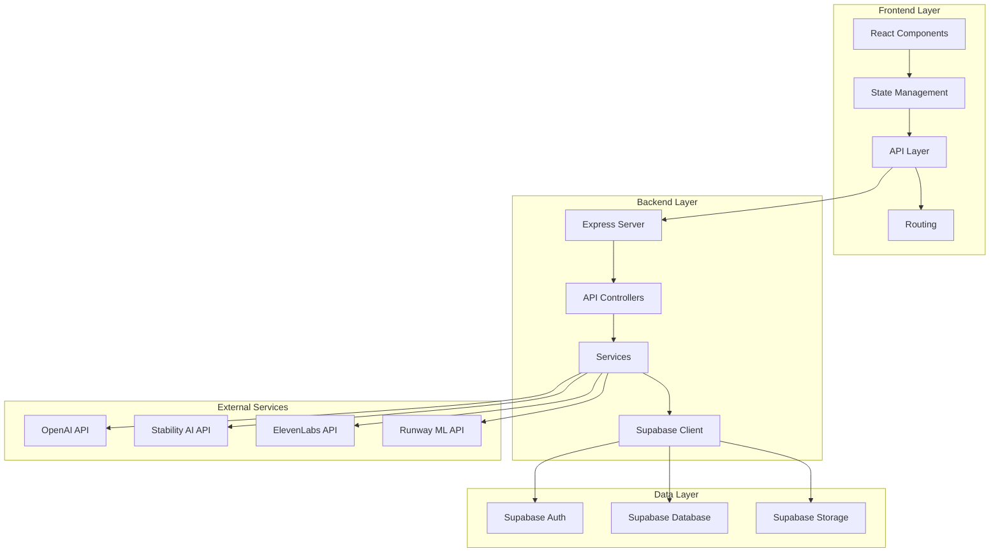
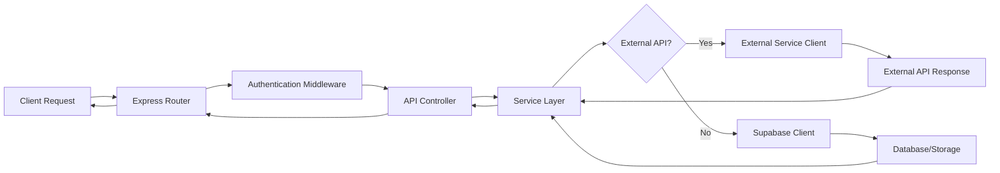
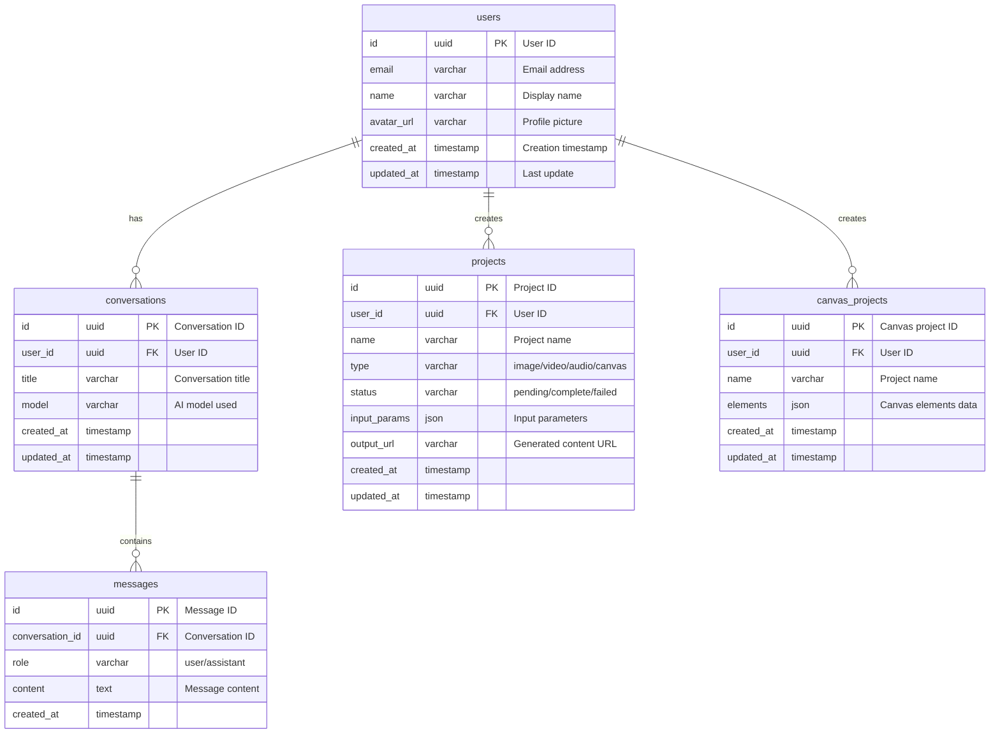

## 1. Architecture Design



## 2. Technology Description

- **Frontend**: React@18 + TypeScript + TailwindCSS@3 + Vite
- **State Management**: Zustand
- **Routing**: React Router DOM
- **Icons**: Lucide React
- **Canvas**: Konva.js / HTML5 Canvas API
- **Backend**: Express@4 + TypeScript
- **Database**: Supabase (PostgreSQL)
- **Storage**: Supabase Storage
- **Authentication**: Supabase Auth
- **External APIs**: OpenAI, Stability AI, ElevenLabs, Runway ML

## 3. Route Definitions

| Route | Purpose | Component |
|-------|---------|-----------|
| / | Dashboard/Home | Dashboard.tsx |
| /image | AI Image Generator | ImageGenerator.tsx |
| /video | AI Video Generator | VideoGenerator.tsx |
| /audio | Audio Generator | AudioGenerator.tsx |
| /chat | LLM Chat | Chat.tsx |
| /canvas | Infinite Canvas | Canvas.tsx |

## 4. API Definitions

### 4.1 Image Generation API

**POST /api/image/generate**
- Request: `{ prompt: string, model: string, style: string, resolution: string, steps: number, cfgScale: number }`
- Response: `{ id: string, url: string, status: 'success' | 'pending' }`

**POST /api/image/transfer**
- Request: `{ imageUrl: string, style: string }`
- Response: `{ id: string, url: string }`

**POST /api/image/enhance**
- Request: `{ imageUrl: string }`
- Response: `{ id: string, url: string }`

### 4.2 Video Generation API

**POST /api/video/generate**
- Request: `{ prompt: string, resolution: string, duration: number }`
- Response: `{ id: string, url: string, status: 'processing' }`

**POST /api/video/convert**
- Request: `{ imageUrl: string, duration: number }`
- Response: `{ id: string, url: string }`

### 4.3 Audio Generation API

**POST /api/audio/speech**
- Request: `{ text: string, voice: string, language: string }`
- Response: `{ id: string, url: string }`

**POST /api/audio/music**
- Request: `{ genre: string, mood: string, duration: number }`
- Response: `{ id: string, url: string }`

**POST /api/audio/effects**
- Request: `{ type: string, parameters: object }`
- Response: `{ id: string, url: string }`

### 4.4 Chat API

**POST /api/chat/message**
- Request: `{ messages: Array<{ role: string, content: string }>, model: string }`
- Response: `{ id: string, content: string, model: string }`

**GET /api/chat/history**
- Response: `{ conversations: Array<{ id: string, title: string, messages: Array }> }`

### 4.5 Canvas API

**POST /api/canvas/project**
- Request: `{ name: string, elements: Array }`
- Response: `{ id: string, name: string }`

**GET /api/canvas/project/:id**
- Response: `{ id: string, name: string, elements: Array, createdAt: string }`

**PUT /api/canvas/project/:id**
- Request: `{ elements: Array }`
- Response: `{ id: string, elements: Array }`

## 5. Server Architecture Diagram



## 6. Data Model

### 6.1 Data Model Definition



### 6.2 Data Definition Language

```sql
CREATE TABLE users (
    id UUID PRIMARY KEY REFERENCES auth.users(id),
    email VARCHAR(255) UNIQUE NOT NULL,
    name VARCHAR(255),
    avatar_url VARCHAR(500),
    created_at TIMESTAMP DEFAULT CURRENT_TIMESTAMP,
    updated_at TIMESTAMP DEFAULT CURRENT_TIMESTAMP
);

CREATE TABLE conversations (
    id UUID PRIMARY KEY DEFAULT uuid_generate_v4(),
    user_id UUID REFERENCES users(id) ON DELETE CASCADE,
    title VARCHAR(255),
    model VARCHAR(100),
    created_at TIMESTAMP DEFAULT CURRENT_TIMESTAMP,
    updated_at TIMESTAMP DEFAULT CURRENT_TIMESTAMP
);

CREATE TABLE messages (
    id UUID PRIMARY KEY DEFAULT uuid_generate_v4(),
    conversation_id UUID REFERENCES conversations(id) ON DELETE CASCADE,
    role VARCHAR(20) NOT NULL CHECK (role IN ('user', 'assistant')),
    content TEXT NOT NULL,
    created_at TIMESTAMP DEFAULT CURRENT_TIMESTAMP
);

CREATE TABLE projects (
    id UUID PRIMARY KEY DEFAULT uuid_generate_v4(),
    user_id UUID REFERENCES users(id) ON DELETE CASCADE,
    name VARCHAR(255),
    type VARCHAR(50) NOT NULL CHECK (type IN ('image', 'video', 'audio')),
    status VARCHAR(20) NOT NULL CHECK (status IN ('pending', 'complete', 'failed')),
    input_params JSONB,
    output_url VARCHAR(500),
    created_at TIMESTAMP DEFAULT CURRENT_TIMESTAMP,
    updated_at TIMESTAMP DEFAULT CURRENT_TIMESTAMP
);

CREATE TABLE canvas_projects (
    id UUID PRIMARY KEY DEFAULT uuid_generate_v4(),
    user_id UUID REFERENCES users(id) ON DELETE CASCADE,
    name VARCHAR(255),
    elements JSONB,
    created_at TIMESTAMP DEFAULT CURRENT_TIMESTAMP,
    updated_at TIMESTAMP DEFAULT CURRENT_TIMESTAMP
);

GRANT SELECT ON users TO anon;
GRANT ALL PRIVILEGES ON users TO authenticated;

GRANT SELECT ON conversations TO anon;
GRANT ALL PRIVILEGES ON conversations TO authenticated;

GRANT SELECT ON messages TO anon;
GRANT ALL PRIVILEGES ON messages TO authenticated;

GRANT SELECT ON projects TO anon;
GRANT ALL PRIVILEGES ON projects TO authenticated;

GRANT SELECT ON canvas_projects TO anon;
GRANT ALL PRIVILEGES ON canvas_projects TO authenticated;
```

## 7. Project Structure

```
src/
├── components/
│   ├── layout/
│   │   ├── Sidebar.tsx
│   │   ├── Header.tsx
│   │   └── Footer.tsx
│   ├── image/
│   │   ├── ImageGenerator.tsx
│   │   ├── ParameterPanel.tsx
│   │   └── StyleSelector.tsx
│   ├── video/
│   │   ├── VideoGenerator.tsx
│   │   └── VideoPreview.tsx
│   ├── audio/
│   │   ├── AudioGenerator.tsx
│   │   └── WaveformDisplay.tsx
│   ├── chat/
│   │   ├── ChatInterface.tsx
│   │   └── MessageBubble.tsx
│   ├── canvas/
│   │   ├── CanvasWorkspace.tsx
│   │   ├── LayerManager.tsx
│   │   └── Toolbar.tsx
│   └── common/
│       ├── LoadingSkeleton.tsx
│       └── Card.tsx
├── pages/
│   ├── Dashboard.tsx
│   ├── ImageGeneratorPage.tsx
│   ├── VideoGeneratorPage.tsx
│   ├── AudioGeneratorPage.tsx
│   ├── ChatPage.tsx
│   └── CanvasPage.tsx
├── hooks/
│   ├── useImageGeneration.ts
│   ├── useVideoGeneration.ts
│   ├── useAudioGeneration.ts
│   ├── useChat.ts
│   └── useCanvas.ts
├── store/
│   └── useStore.ts
├── utils/
│   └── api.ts
├── types/
│   └── index.ts
└── App.tsx

api/
├── controllers/
│   ├── imageController.ts
│   ├── videoController.ts
│   ├── audioController.ts
│   ├── chatController.ts
│   └── canvasController.ts
├── services/
│   ├── imageService.ts
│   ├── videoService.ts
│   ├── audioService.ts
│   ├── chatService.ts
│   └── canvasService.ts
├── routes/
│   └── index.ts
├── middleware/
│   └── auth.ts
└── server.ts
```
